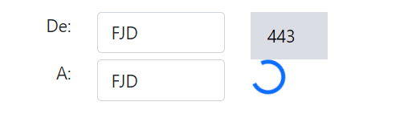
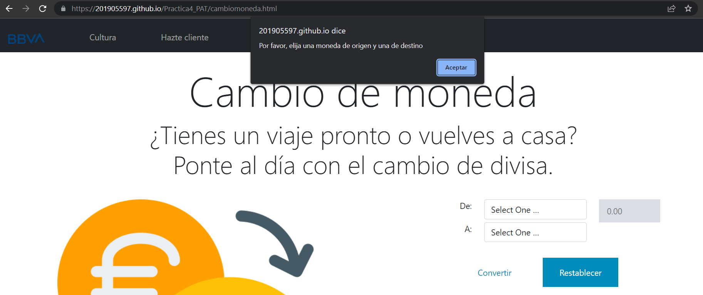
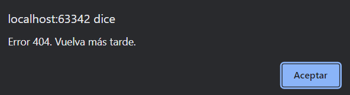

# PRÁCTICA 4 - PAT
## Claudia Blanco 3ºA
###### Página de BBVA. Javascript. 

Se ha ampliado la página creada en la práctica anterior utilizando una API (ver cambiomoneda.html).
La página principal es index.html. Al resto de páginas interconectadas (contacto.html, cultura.html, cultura2.html, cultura3.html, cuentametas.html, cuentacero.html, perfilescuenta.html, cambiomoneda.html) se puede acceder mediante una barra de navegación.

La página está publicada en el siguiente link:

https://201905597.github.io/Practica4_PAT/

A continuación se especifica qué elementos de Bootstrap, HTML, CSS y Javascript se han utilizado:

> El alumno empleando los conocimientos adquirido en el aula sobre
HTML, CSS y Javascript, creará un documento web que permita
interaccionar con una API REST y visualice en el documento la información.
El documento empleará el Framework CSS Bootstrap.

La programación en Javascript incluirá:

- Uso de llamadas asíncronas a un API Rest
- Uso de interacción al DOM del documento para visualizar la información

> La programación en Javascript incluirá:

> - Uso de llamadas asíncronas a un API Rest
> - Uso de interacción al DOM del documento para visualizar la información

Se mantienen los elementos de Bootsrap de prácticas anteriores:
> - Títulos
En todas las páginas se han usado headings
> - Párrafos

Se han usado también en casi todas las páginas (ver index.html)

> - Multimedia

Imágenes y vídeos (ver cultura.html)
> - Formularios Web

Ver contacto.html
> - Enlaces

Ver footer

> y además estructuras y componentes propuestos por el
> Framework CSS Bootstrap como son:

> - Grid

En página principal, Hazte Cliente...
> - Nav

En todas las páginas
> - Footer

En todas las páginas
> - Tipografía 

Títulos y párrafos con Display, párrafos con partes en negrita... 
> - Tablas

Ver Cuenta Cero y Cuenta Metas (se puede acceder desde la página principal index.html)
> - Botones

Ver página principal, página de "Hazte Cliente"...
> - Alertas

Ver página principal
> - Objetos de paginación

Ver cultura.html, cultura2 y cultura3
> - Carousel

Página principal y Hazte Cliente

> - Spinner
Ver página Cambio de Moneda

> Uso de JavaScript
- registro.js permite mostrar una ventana pop-up de confirmación del envío de un formulario, y permite validar los campos de nombre y correo electrónico
- mostrarinfo.js permite esconder/mostrar información sobre diferentes tipos de cuenta, según el botón que se pulse en el carousel de perfilescuenta.html
- cambiomoneda.js permite al usuario ver la equivalencia de monedas de diferentes países con una API; además, tiene gestión de errores:
    - Si no se introduce moneda destino y origen se avisa al usuario con una alerta
    
    - Si el status de lo que devuelve la API es 404, también aparece una alerta pop up indicándolo
    